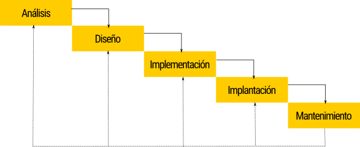

# Plantejament del desenvolupament d'una app

## Fases en el desenvolupament d'una aplicació

El primer que tenim que fer per a començar és coneixer les diferents fases per les que una aplicacio te que pasar

---

**Fase d'anàlisi**

---
Es determinen els requisits que tindrà l'aplicació, a través d'una anàlisi del problema. També s'inclou una cerca de possibles solucions en el mercat. A més dels requisits funcionals de l'aplicació, es especificaran els models de dades i comportament que aquesta tindrà. En aquesta fase

---

**Fase de disseny**

---

A partir dels requeriments de la fase d'anàlisi, i tenint en compte els recursos del sistema (hardware i software), creem la solució al problema. Així com en la fase d'anàlisi es determinava "Què" es vol implementar, en aquesta fase s'establirà "Com".

---

**Fase de codificació o implementació**

---

Es transformen els algoritmes dissenyats en la fase anterior en programes expressats en determinat llenguatge de programació. A més, s'han de realitzar proves per assegurar la qualitat del software.

---

**Fase d'implantació**

---

Implica la posada en producció del producte software, la seua instal·lació en els sistemes, realització de proves d'acceptació, migració de la informació i reemplaçament del sistema anterior. A més, s'haurà de proveir a l'usuari final de la documentació per a l'explotació i el bon ús del sistema.

---

**Fase de manteniment**

---

On es corregeixen errors no detectats prèviament, es realitzen millores en la funcionalitat de l'aplicació o s'afegeixen noves. Diferenciem el manteniment correctiu, en el qual es detecten errors de codificació no detectats, el manteniment adaptatiu, en el qual adaptem l'aplicació a nous entorns, i el manteniment perfectiu, on s'afegeixen noves funcionalitats a l'aplicació.

## Models de desenvolupament de software

Despres de coneixer les fases, tindrem que elegir com inplementarles. Así tenim alguns posibles models.

---

**Cicle de vida en cascada**

---

Es tracta del model clàssic, segons el qual les diferents fases del cicle de vida s'ordenen de forma seqüencial, de manera que la documentació generada en una fase serveix com a punt de partida per a la següent. En aquest model, per començar una fase, hem d'haver acabat completament l'anterior.

---

**Construcció de prototips**

---

Es basa en la introducció del prototipat com una eina per a la validació de requisits per part del client. Es construeix un prototip de l'aplicació, de manera que el client puga corregir errors en la presa de requisits abans de començar amb el desenvolupament.

En tot cas, el client ha de ser conscient que es tracta d'un prototip per a la validació de requisits, i no el producte en si. En alguns desenvolupaments, el prototip es desenvolupa mitjançant eines específiques per a això, sent descartat una vegada validat per donar pas al desenvolupament.

---

**Model iteratiu i incremental**

---

Aquest model combina les fases del model en cascada, aplicades de forma repetida, juntament amb la interactivitat amb el client que aporten el desenvolupament de prototips.

En aquest cas, el prototip no es descarta, sinó que es reutilitza, i en diferents iteracions del model en cascada, va incrementant la seua funcionalitat fins a convertir-se en l'aplicació final (prototipat evolutiu).

En aquest model, en un primer moment es realitza una anàlisi general del sistema i es especifiquen les funcionalitats que aquest haurà de tenir, de manera que segons aquestes es planifiquen les diferents iteracions que es realitzaran durant el desenvolupament.

---

**Model en espiral**

---

Es tracta d'un model similar a l'iteratiu, amb la principal diferència que es tracta d'un procés continu durant tota la vida útil del software. Així com en el model iteratiu i incremental es coneixia d'antuvi quantes iteracions es farien, en el model en espiral no existeix un nombre preestablert d'iteracions.

